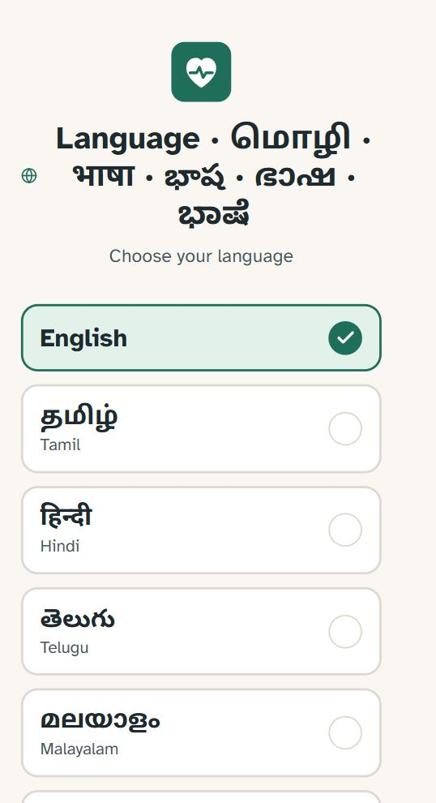
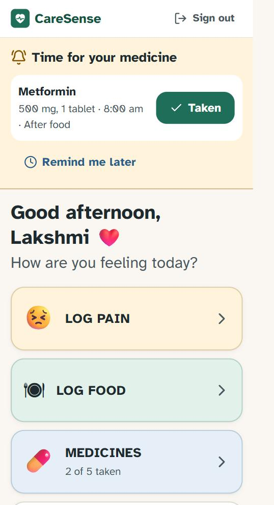
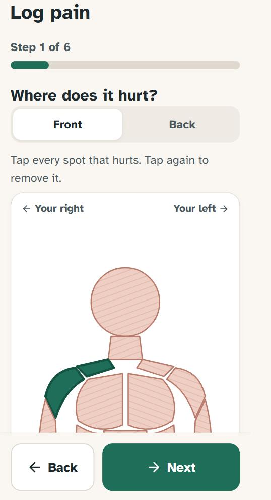
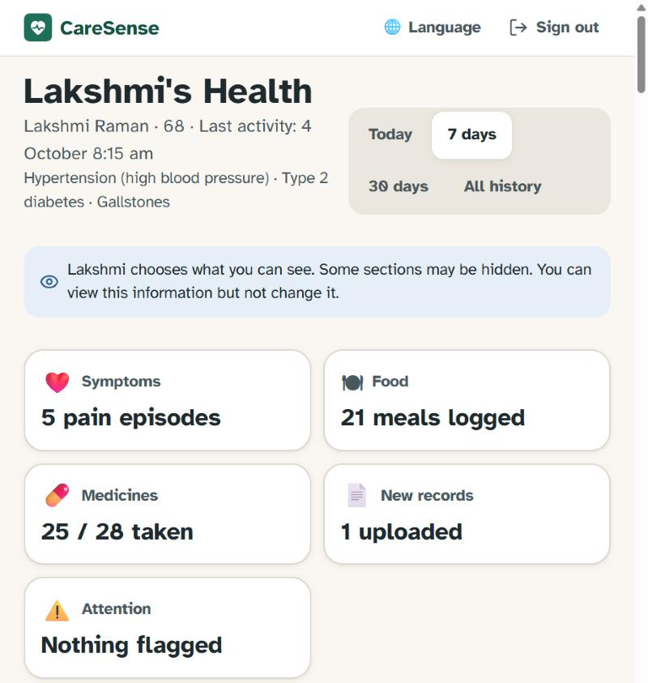
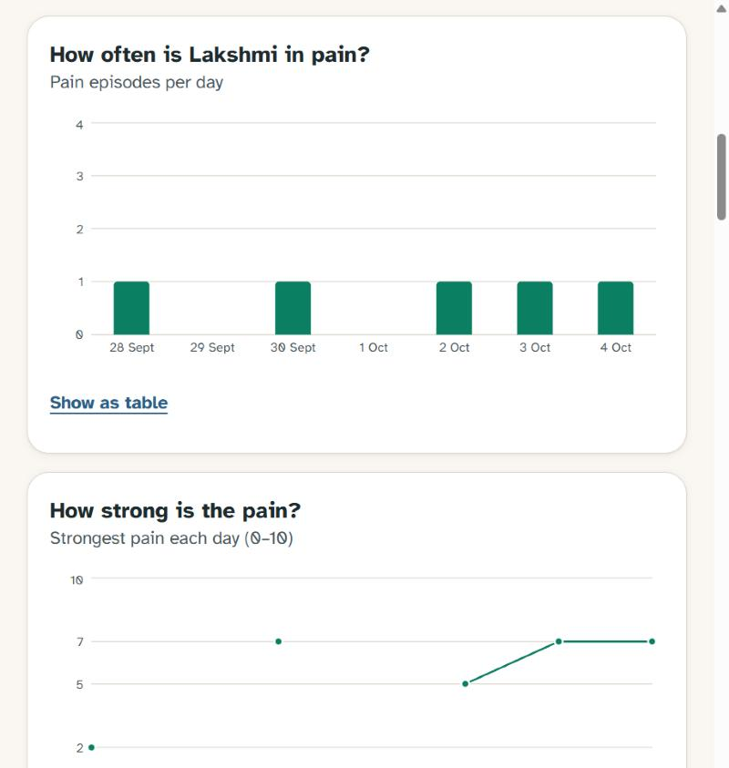

# CareSense

> *Your family may be far away. Your health information doesn't have to be.*

### 🔗 Live demo: **[caresense-delta.vercel.app](https://caresense-delta.vercel.app)**

CareSense is an elderly-friendly health companion. An older parent logs pain, meals and medicines in a few large taps, keeps medical reports in one place, and asks questions in plain language. An adult child who lives far away sees **only what the parent chooses to share**.

| Choose a language | Home with medicine reminder | Tap where it hurts |
|:---:|:---:|:---:|
|  |  |  |

| Family dashboard | Trends for the family |
|:---:|:---:|
|  |  |

### Try it in 60 seconds

The demo uses a **fictional** patient, and there is nothing to install or sign up for.

1. Open the [live demo](https://caresense-delta.vercel.app) and choose a language.
2. **As the parent:** *I'm the Parent* → **Continue as Lakshmi**. Try *Log Pain* (tap the body, then the exact muscle), *Log Food*, and *Medicines*.
3. **As the daughter abroad:** tap **Sign out**, then *I'm a Family Member* → **Continue as Priya** to see the dashboard, charts and alerts.
4. Switch language at any time: try தமிழ் or हिन्दी.

Notes for visitors: the demo resets from time to time, and the AI features (report summaries, free-form questions) are switched off in the public demo.

### What it shows

- **Designed for older users:** large buttons, plain words, voice input, 6 languages.
- **Safety first:** emergency symptoms are detected by fixed rules, in every language, before any AI answers. The app never gives advice about changing medicines.
- **Privacy by design:** the parent chooses exactly what family can see and can turn access off instantly.
- **Built with AI-assisted development** (Claude Code), from product spec to deployed app, with 32 automated tests.

**CareSense is not a doctor.** It does not diagnose, prescribe, or change medicines. Its job is:
**collect → organise → explain → notice changes → escalate when appropriate → connect family.**

All demo data (the patient "Lakshmi Raman", her reports, clinicians and phone numbers) is **fictional**.

**Languages:** English, தமிழ், हिन्दी, తెలుగు, മലയാളം, ಕನ್ನಡ. The first screen asks the user to choose one. Everything follows that choice: the interface, dates, AI answers, report summaries and dish lookups. A family member can read in a different language from the parent.

**What's new in v1.1:**

- **Language picker** on first launch, with the full app translated into five Indian languages.
- **Onboarding** now asks for date of birth, sex and past medical history, and ends with "Add your existing medical reports".
- **Muscle map for pain:** front and back, 24 muscle areas on each side. The first tap zooms in, the next taps choose exact spots.
- **Food:**
  - 32 common foods (South and North Indian), searchable in any language or romanised spelling.
  - AI dish lookup: "cabbage koottu" or "முட்டைகோஸ் கூட்டு" returns typical ingredients and estimated protein per portion.
  - Real portions (½ bowl, 3 idli) instead of "Medium".
- **Voice input** ("Speak") in the chosen language, for questions and food.
- **Multilingual safety:** red flags are detected in Indian languages and romanised forms ("nenju vali", "seene me dard").
- **Friendly "I didn't understand"** for accidental typing.
- **Medicine reminders:** a banner and phone notification at each dose time with a one-tap "Taken" button, a calendar export so the phone rings even when the app is closed, and a "not marked yet" alert for family.

See [`docs/APP_STORE_PLAN.md`](docs/APP_STORE_PLAN.md) for the path to the App Store and Play Store.

---

## Quick start (demo mode, about 2 minutes)

Requirements: Node.js 20+.

```bash
npm install
npm run dev
```

Open http://localhost:3000.

With no Supabase variables set, CareSense runs in **demo mode**. It uses a local JSON store in `./.data`, seeded automatically with the fictional patient.

| Try | How |
|---|---|
| Parent view | *I'm the Parent* → **Continue as Lakshmi** |
| Family view | *I'm a Family Member* → **Continue as Priya** |
| Fresh onboarding | *Start fresh as a new parent*, then invite a family member. In another browser, choose *Start fresh as a new family member* and enter the invite code. |
| Sample report to upload | `public/samples/sample-ultrasound-report.png` (fictional) |
| Reset demo data | stop the server, then run `npm run demo:reset` |

To turn on the AI features, add `ANTHROPIC_API_KEY` to `.env.local` (see below). Without a key, everything else still works. The safety engine, the medicine guard and simple factual answers are deterministic. AI summaries show a friendly "not available right now" message with a retry button.

### Commands

```bash
npm run dev         # development server
npm run build       # production build
npm test            # safety (English + Indian languages), muscles, food search, grounding, reminders (32 tests)
npm run typecheck   # TypeScript
npm run demo:reset  # wipe and re-seed demo data
```

---

## Environment variables

Copy `.env.example` to `.env.local`. **None of these variables reach the browser**: no variable uses the `NEXT_PUBLIC_` prefix, and every Supabase and AI call runs on the server.

| Variable | Purpose |
|---|---|
| `SUPABASE_URL`, `SUPABASE_ANON_KEY` | Setting both switches to Supabase mode (Postgres + Auth + Storage + RLS) |
| `SUPABASE_RECORDS_BUCKET` | Private storage bucket for original documents (default `medical-records`) |
| `SESSION_SECRET` | Signs demo-mode session cookies. Required in production. |
| `DEMO_MODE_ALLOWED_IN_PRODUCTION` | Demo mode refuses to run when `NODE_ENV=production` unless this is `true` |
| `ANTHROPIC_API_KEY` | Enables document reading and the AI companion |
| `CARESENSE_AI_MODEL` | Optional model override (default `claude-opus-5`) |

---

## Database setup (Supabase)

1. Create a Supabase project.
2. In **SQL Editor**, run [`supabase/schema.sql`](supabase/schema.sql). It creates the tables, the row-level security policies, the `accept_family_invite` function, and the private `medical-records` storage bucket with its policies.
3. **Authentication → Providers**: enable Email. You can turn off "Confirm email" for testing; if you leave it on, users see a "check your email" message after sign-up.
4. Set `SUPABASE_URL` and `SUPABASE_ANON_KEY` in `.env.local`, then restart the server.
5. Optional: seed the fictional demo accounts. Run this from your own machine only, because the service-role key bypasses RLS and must never be deployed:

   ```bash
   SUPABASE_URL=... SUPABASE_SERVICE_ROLE_KEY=... DEMO_PASSWORD=choose-one npx tsx scripts/seed-supabase.ts
   ```

   This creates `lakshmi@demo.caresense.invalid` (parent) and `priya@demo.caresense.invalid` (family).

## Deployment (Vercel)

1. Push the repo and import it into Vercel.
2. Set these environment variables: `SUPABASE_URL`, `SUPABASE_ANON_KEY`, `SESSION_SECRET` (32+ random characters), and `ANTHROPIC_API_KEY`.
3. Deploy. `/api/records/[id]/extract` declares `maxDuration = 180` because reading a document can take a minute. Your plan must allow this.
4. Don't deploy in demo mode with real users. Demo mode stores data in a local file, which is ephemeral on serverless platforms.

Any Node host works too: `npm run build && npm start`.

---

## Architecture

```
Browser (React, Tailwind)                      Server (Next.js route handlers)
───────────────────────────                    ─────────────────────────────────────────
Parent UI  /parent/*   ──fetch JSON──►  /api/*  ── route() wrapper: auth ctx, friendly error codes
Family UI  /family/*                            │
Welcome / login / onboarding                    ├─ access.ts        RBAC: requireParent / requireFamilyAccess(perm)
                                                ├─ safety/engine.ts deterministic red-flag rules (no LLM)
lib/i18n   all UI text                          ├─ ai/companion.ts  safety → med guard → lookup → LLM → grounding
lib/client api + formatting                     ├─ ai/extract.ts    document AI (PDF/photo → text, summary, sourced facts)
                                                ├─ services/*       timeline, notifications, records, pain, meds
                                                └─ db/Store         ┬─ demo-store.ts      JSON file (demo mode)
                                                                    └─ supabase-store.ts  Postgres with user JWT → RLS
```

- **One storage interface, two backends.** Services only talk to `Store` (`list/get/insert/update/remove`) and `FileStore` (`put/get`). Demo mode and Supabase are interchangeable, and both use the same column names ([`types.ts`](src/lib/types.ts) mirrors [`schema.sql`](supabase/schema.sql)).
- **Supabase queries run as the signed-in user.** The server builds its Supabase client from the user's own session cookies, so Postgres RLS makes the final access decision. The service-layer checks in `access.ts` run first as defence in depth, and they are the only checks in demo mode.
- **Pages are client components that call a JSON API.** This gives every screen real loading, empty and error states, and keeps the backend usable by a future native app.
- **Extensible by design.** New features such as wearables, appointments or a clinician portal would be new tables and new services behind the same `Store`, access helpers and i18n system.

### Folder guide

| Path | What's there |
|---|---|
| `src/app/parent/*` | Parent screens: home, pain flow and history, food, medicines, reports, timeline, ask, contact, privacy, profile |
| `src/app/family/*` | Family dashboard, join with invite code, read-only report view |
| `src/app/api/*` | All backend endpoints |
| `src/components/*` | Reusable UI: `Button`, `LargeActionCard`, `PainBodyMap`, `PainSeveritySelector`, `SymptomSelector`, `MealCard`, `MedicationCard`, `MedicalRecordCard`, `Timeline`, `AlertCard`, `FamilyMemberCard`, `HealthMetricCard`, `AIChat`, `DocumentUploader`, `ConfirmationModal`, `UrgentWarning`, … |
| `src/lib/safety` | Safety engine and its tests |
| `src/lib/ai` | Anthropic client, companion, document extraction, grounding (tested), offline lookups |
| `src/lib/i18n` | `en.ts` (every UI string) and the locale registry |
| `src/lib/demo` | Fictional seed data and a tiny PDF writer for the demo reports |
| `supabase/schema.sql` | Tables, RLS, storage policies |

---

## AI safety design

Each layer runs in order. A layer that matches stops the chain.

1. **Deterministic safety engine first** ([`safety/engine.ts`](src/lib/safety/engine.ts)). Every chat message and every pain entry is checked against fixed, reviewable rules before any AI runs. The rules cover chest pain, breathing difficulty, fainting, severe abdominal pain, persistent vomiting, confusion, severe weakness, blood in vomit or stool, new neurological signs, severe allergic reaction, jaundice with fever, self-harm language, and structured combinations such as "strong abdominal pain + fever/chills/vomiting" or "very strong pain".
   - If a rule matches, the app shows the urgent-care screen **instead of** an answer. The screen offers *Call emergency services* and *Call family member*, gives no reassurance and no diagnosis, and never says "wait and see".
   - The engine leans toward escalating. Negation handling ("no chest pain") is deliberately narrow.
   - The alert is logged. If the parent allows it, family members are notified. The notification never includes the message text.
   - **Multilingual safety:** checks run in three layers.
     - The English rules.
     - Phrase lists for Tamil, Hindi, Telugu, Malayalam and Kannada, in native script and romanised forms ([`safety/multilingual.ts`](src/lib/safety/multilingual.ts)). These work offline.
     - When AI is available, the message is translated to English and the English rules run again. The decision is still made by the rules; translation only widens what they can catch.
   - ⚠ The phrase lists must be reviewed by native-speaking clinicians before launch.
2. **Medication guard.** Questions about stopping, skipping, doubling or changing a medicine get a fixed answer: "please talk to your doctor first". The answer names the prescribers on file. The model is never asked.
3. **Deterministic lookups.** Questions like "What medicines am I taking?" and "When was my last pain?" are answered straight from the database, so they can't hallucinate.
4. **Grounded LLM answers** ([`ai/companion.ts`](src/lib/ai/companion.ts)).
   - The model sees only the patient's own data inside `<patient_context>`. Document text is marked as data, not instructions, which defends against prompt injection hidden in uploaded files.
   - The model must return labelled sections: **documented** ("Your report says…"), **reported** ("You told me…"), **general** ("In general…"), and **suggestion** ("You may want to ask your doctor…").
   - The model can declare *insufficient information*. The UI then shows: "I don't have enough information to answer that safely."
5. **Post-checks on model output** ([`ai/grounding.ts`](src/lib/ai/grounding.ts), unit-tested).
   - A *documented* claim is kept only if it cites a real document **and** its quote appears verbatim in that document's text. Otherwise it is dropped.
   - Sentences that read like medication instructions are dropped.
   - If nothing survives, the answer becomes "not enough information".
6. **Document AI** ([`ai/extract.ts`](src/lib/ai/extract.ts)).
   - The original file is stored first and never modified. Storage has no update or delete policy, and the demo store writes files in exclusive mode.
   - The model transcribes the document, then summarises it. Every finding and timeline event must quote the transcription, and events must carry a date printed in the document. Anything else is discarded, so dates are never invented.
   - Unreadable images produce: "The report could not be read reliably. Please upload a clearer image or ask your doctor."
7. **Model call details.** Model `claude-opus-5` with adaptive thinking and structured outputs (Zod schemas). Server-side refusal fallbacks (`fallbacks: "default"`) are enabled, so a safety-classifier decline is retried on a fallback model instead of failing. A `refusal` stop reason or any API error becomes a friendly "helper unavailable" message.

## Privacy model

- **Authentication required** for every API route. Roles are `parent` and `family`.
- **The parent owns the data.** Family members see a patient only through an **active** link, and only the categories the parent has switched on:
  - symptoms
  - meals
  - medicines
  - reports
  - timeline
  - safety alerts

  Hidden sections show up in the family dashboard as "Not shared".
- **Revocation is immediate.** The dashboard, the APIs, reports and raw files all return "access turned off" on the next request. RLS enforces this in the database as well.
- **Family members are read-only.** No write endpoint accepts a family session for the parent's health data.
- **Notifications need two switches.** A notification is created only when the parent has turned on both the alert type and the matching data permission. For example, a "new report" alert also needs the reports permission.
- **Audit log.** Family views, report opens, uploads, permission changes and revocations are recorded. The parent can see them under *Privacy & family sharing → Recent access*.
- **No medical data in logs or error messages.** Server logs record only the route and the error class. The browser receives short error codes and maps them to friendly text.
- **Secrets stay on the server.** The Anthropic key and Supabase keys are server-only. The service-role key is used only by the local seed script.
- **Storage.** Originals live in a private Supabase bucket, readable only through RLS-checked policies, and are served through an authenticated route with `Cache-Control: private, no-store`. Supabase encrypts data at rest.
- **Security headers.** `nosniff`, `DENY` framing, `no-referrer`.

## Accessibility and elderly-first design

- 18px base size (all sizing uses `rem`, so it respects the browser's font setting). Body text is 20px or larger. The typeface is **Atkinson Hyperlegible**, which was designed for low-vision readers.
- Touch targets are at least 48px, and primary actions are at least 72px. Every icon has a text label, so nothing relies on an icon alone.
- Selection states use a check mark and a thicker border as well as colour. Status is always shown as text.
- Colours meet WCAG AA or better. The UI is light-only and calm, with no motion when `prefers-reduced-motion` is set.
- Native `<dialog>` provides focus trapping and Esc to close. Choice controls use `role=radio` / `checkbox` / `switch` with `aria-checked`. The layout includes a skip link, `aria-live` for toasts and chat, and a visible 3px focus ring.
- The body map comes with an equivalent list of labelled buttons, and front-view sides are labelled "Your right" and "Your left".
- Charts have a table view, a text title that states the question each chart answers, and hover tooltips.
- Speaking instead of typing works through the phone keyboard's microphone, and the chat screen mentions this.

## Localization

All UI text comes from [`src/lib/i18n/en.ts`](src/lib/i18n/en.ts). It is translated in `ta.ts`, `hi.ts`, `te.ts`, `ml.ts` and `kn.ts`, and every key is covered.

- **How the language choice works:** the choice is saved in a cookie and on the patient's profile, so AI answers and report summaries follow it too.
- **Fonts:** Noto Sans is loaded for Indian scripts.
- **Dates:** formatted by the browser in the chosen language.
- **Notifications:** stored as a type plus parameters, so each reader sees them in their own language.

**To add another language:**

1. Copy `en.ts` to a new file, e.g. `bn.ts`, and translate the values.
2. Register the file in `LOCALES` in [`src/lib/i18n/index.ts`](src/lib/i18n/index.ts).

Missing keys fall back to English.

⚠ **All translations are machine-assisted.** Have a native speaker review each language before launch, and a clinician review the safety text.

---

## What was tested

| Journey | Result |
|---|---|
| 1. Log abdominal pain in under 60 s | Done in the browser: 13 taps across the 6-step flow |
| 2. Log breakfast without typing | Done: Idli (3) and Curd (1 cup), with a protein estimate against the clinician goal and a disclaimer |
| 3. Upload an ultrasound image | Done: the stored original is byte-identical to the upload (SHA-256 checked) |
| 4. AI explains the report using only its content | Grounding logic unit-tested. **Not run against the live model** (no API key on the build machine). |
| 5. Severe pain + fever/vomiting → urgent warning | Done: the urgent screen appears before anything else, with call buttons and a family notification |
| 6. Adult child sees shared data | Done: overview, alerts, charts, timeline, reports, medicines, meals |
| 7. Parent revokes access | Done: dashboard, API, report and raw-file requests are all refused immediately |
| 8. "Not enough information" | Unit-tested (the model flag, plus all claims ungrounded). **Not run against the live model.** |

Also tested: invite codes (a code works once, bad codes are refused), role separation (a family session can't call parent endpoints), default "reports not shared" for new invites, the medicine-change guard, deterministic lookups, and chest-pain escalation in chat.

## Known limitations of v1

- **Supabase mode** (`supabase-store.ts`, `schema.sql`, the seed script) is written against the documented APIs but **has not yet been run against a live Supabase project**. Every end-to-end test above used demo mode.
- **AI output is untested live.** The model calls follow the current Anthropic SDK (`@anthropic-ai/sdk` 0.128) and type-check, but they need an `ANTHROPIC_API_KEY` for a live test.
- Family notifications are **in-app only**. Email, SMS and push are natural next steps; the notification rows and permission checks already exist.
- The **Speak** button uses the browser's speech recognition. It works in Chrome on Android and desktop, but not in Firefox. Inside a future store app it needs a native plugin (see the store plan).
- The **muscle map** is a detailed 2D illustration, not a 3D model. It's designed for older hands: tap once to zoom in, then tap the exact spot.
- **No in-app account deletion or data export yet.** Both are required before a store launch.
- Session time zone comes from the browser. A per-patient stored time zone would be better for families in different countries.
